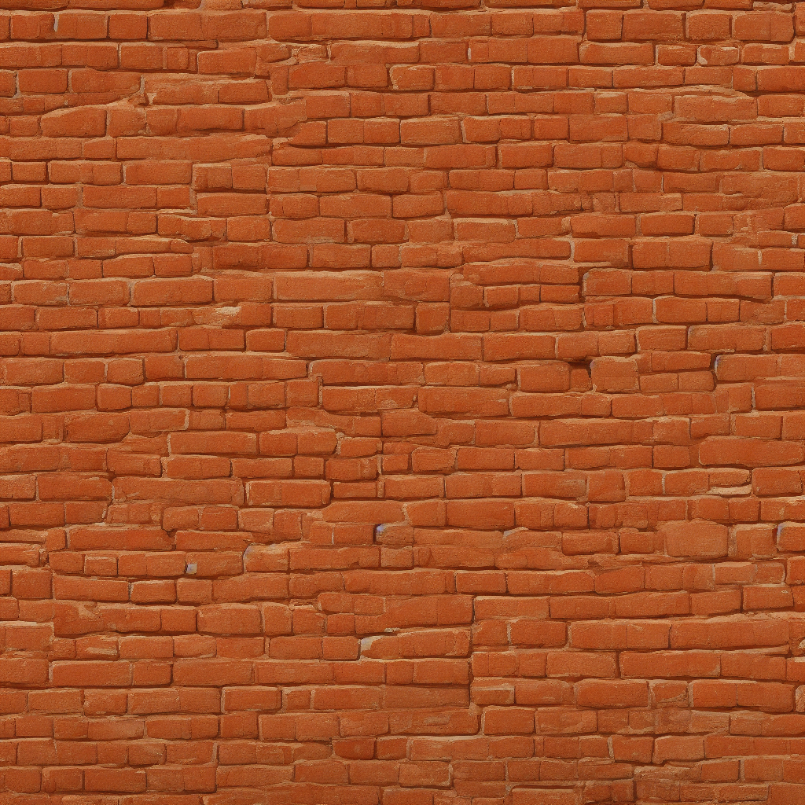
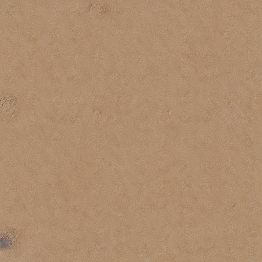

# TexturePipeline

TexturePipeline is an educational project created while learning how to combine ASP.NET Core, Python, ComfyUI, Ollama, and Docker into a single image-generation pipeline.

The project generates PBR texture sets from a text description:

- Albedo;
- Normal;
- Height;
- Roughness;
- Ambient Occlusion.

The generated Albedo textures are generally decent and can provide a useful base for further editing. However, the additional PBR maps are produced from the Albedo image using heuristic OpenCV processing, so their quality is currently limited.

This is not a production-ready material generation tool. It is an experiment and a learning project.

## Architecture

```text
Client
  |
  v
ASP.NET Core API
  |
  +-- Ollama
  |     Generates a Stable Diffusion prompt
  |
  +-- ComfyUI
  |     Generates the Albedo texture
  |
  +-- Python PBR Engine
        Generates additional PBR maps
```

## Technology Stack

- ASP.NET Core
- FastAPI
- OpenCV
- ComfyUI
- Ollama
- Docker Compose
- Stable Diffusion 1.5

## Requirements

- Docker Desktop or Docker Engine;
- Docker Compose v2;
- at least 30 GB of free disk space;
- at least 8 GB of RAM;
- NVIDIA GPU recommended.

CPU mode is supported but significantly slower.

## Tested Configuration

```text
GPU: NVIDIA GeForce GTX 1050 Ti
VRAM: 4 GB
ComfyUI: v0.30.0
PyTorch: 2.5.1 + CUDA 12.1
comfy-kitchen: 0.2.26
```

## Configuration

Create `.env` from the example:

```powershell
Copy-Item .env.example .env
```

Default settings:

```env
API_PORT=8080
COMFYUI_PORT=8188
RESULTS_PATH=./data/textures
COMFY_ARGS=
```

| Variable | Description |
|---|---|
| `API_PORT` | Local ASP.NET API port |
| `COMFYUI_PORT` | Local ComfyUI web port |
| `RESULTS_PATH` | Directory for generated maps |
| `COMFY_ARGS` | Optional ComfyUI startup arguments |

Leave `COMFY_ARGS` empty to enable automatic hardware detection.

## Build

```powershell
docker compose --progress plain build
```

The first build downloads several large images and can take a significant amount of time.

## Run with NVIDIA GPU

```powershell
docker compose `
    -f docker-compose.yml `
    -f docker-compose.nvidia.yml `
    up -d
```

## Run without NVIDIA GPU

```powershell
docker compose up -d
```

## Local URLs

| Service | URL |
|---|---|
| API | `http://localhost:8080` |
| ComfyUI | `http://localhost:8188` |

Ollama and Python Engine are available only inside the Docker network.

## Generate a Texture

```powershell
$body = @{
    description = "weathered red brick wall"
    resolution = 512
    seed = 12345
} | ConvertTo-Json

$response = Invoke-RestMethod `
    -Method Post `
    -Uri "http://localhost:8080/api/textures/generate" `
    -ContentType "application/json; charset=utf-8" `
    -Body $body

$response
```

Example response:

```json
{
  "jobId": "6c00c0d1-fb52-4905-8e15-b99e14b670e5",
  "seed": 12345,
  "resolution": 512,
  "statusUrl": "http://localhost:8080/api/textures/jobs/6c00c0d1-fb52-4905-8e15-b99e14b670e5"
}
```

The resolution must:

- be between `512` and `2048`;
- be divisible by `64`.

The seed is optional.

## Check Job Status

```powershell
$jobId = $response.jobId

Invoke-RestMethod `
    -Uri "http://localhost:8080/api/textures/jobs/$jobId"
```

Possible statuses:

```text
pending
processing
done
failed
```

## Open a Generated Map

```powershell
Start-Process `
    "http://localhost:8080/api/textures/jobs/$jobId/image/albedo"
```

Available map names:

```text
albedo
normal
height
roughness
ao
```

Generated files are also stored in:

```text
data/textures/<job-id>/
```

## Texture Quality

The Stable Diffusion and ComfyUI part of the pipeline usually produces a reasonable Albedo texture.

The generated Normal, Height, Roughness, and Ambient Occlusion maps are more limited. They are estimated from a single Albedo image and do not contain real information about the material's physical structure.

Current problems include:

- inaccurate height estimation;
- lighting and shadows being interpreted as surface geometry;
- weak Normal map details;
- generic Roughness values;
- Ambient Occlusion that does not always match the material;
- inconsistent results across different material types.

I experimented with several OpenCV-based approaches but did not find a general solution that produces consistently high-quality PBR maps for every material.

A better solution would probably require:

- a dedicated depth or material-estimation model;
- material-specific processing;
- additional training data;
- or direct multi-map generation instead of deriving every map from Albedo.

The current implementation should therefore be treated as a prototype rather than a physically accurate PBR material generator.

## Logs

```powershell
docker compose logs -f
```

Press `Ctrl+C` to stop following logs. The containers will continue running.

## Stop

```powershell
docker compose `
    -f docker-compose.yml `
    -f docker-compose.nvidia.yml `
    down
```

Generated files and downloaded models are preserved.

## Project Structure

```text
TexturePipeline/
├── TexturePipeline.Api/
├── TexturePipeline.ML/
├── TexturePipeline.Comfy/
├── TexturePipeline.Ollama/
├── data/
├── .env.example
├── docker-compose.yml
├── docker-compose.nvidia.yml
└── README.md
```
## Examples

Examples of Albedo textures generated by the pipeline:

<p align="center">
  
  
</p>

The pipeline generally produces reasonable Albedo textures that can be used as a base for further editing.

Normal, Height, Roughness, and Ambient Occlusion maps are derived from the Albedo image using heuristic OpenCV processing. These maps are experimental and are not physically accurate.

## Notes

- Required models are downloaded during the first startup.
- Models are stored in Docker volumes.
- Low-memory GPUs automatically use reduced VRAM settings.
- The first generation is usually slower because models must be loaded into memory.
- Do not expose ComfyUI or Ollama directly to the public internet.

## Current Limitations

- This is an educational project and is not production-ready.
- Albedo quality is generally better than the derived PBR maps.
- Normal, Height, Roughness, and AO maps are heuristic estimates and are not physically accurate.
- PBR map quality varies significantly between material types.
- Jobs are stored in memory and are lost after an API restart.
- Background generation currently uses an in-process task.
- Authentication is not implemented.
- Rate limiting is not implemented.
- Generated files are stored locally.
- A low-memory GPU should process one generation at a time.
- Ollama and ComfyUI may share the same GPU.

## Contributing

This is an educational project, and contributions are welcome.

If you know how to improve the PBR map generation, GPU memory usage, job processing, API architecture, or Docker setup, I would be grateful for your help.

You can contribute by:

- opening an issue;
- suggesting a better algorithm;
- improving the OpenCV processing;
- integrating a depth or material-estimation model;
- fixing bugs;
- improving documentation;
- submitting a pull request.

Feedback and experiments are also welcome, even if they do not include a complete implementation.

## Possible Improvements

- persistent job storage;
- background job queue;
- ZIP download for complete texture sets;
- automatic result cleanup;
- API authentication;
- rate limiting;
- frontend application;
- S3-compatible object storage;
- dedicated depth estimation;
- AI-based material map generation;
- automated integration tests.

## License

This project does not currently include a dedicated license.

Third-party models, libraries, and services are distributed under their own licenses. Review their terms before commercial use.